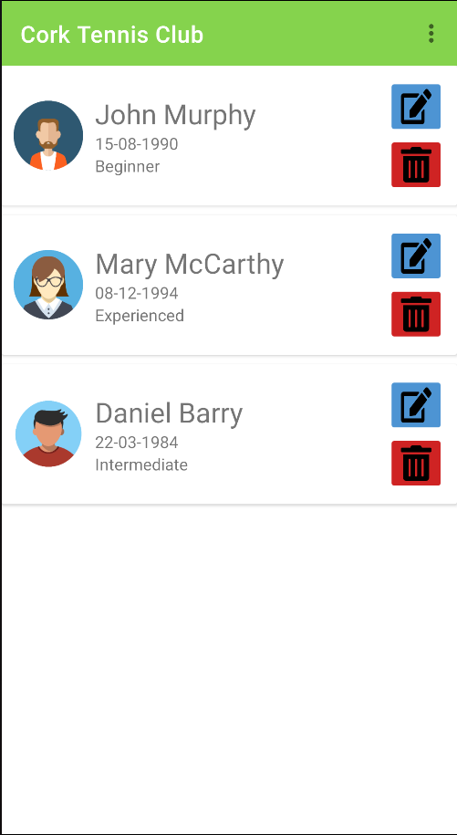
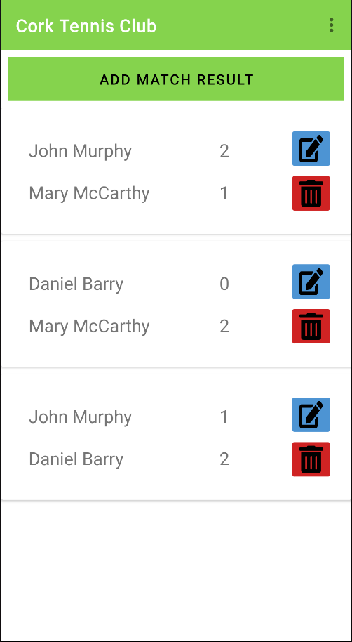

# Cork Tennis Club

An Android mobile app developed which stores and displays data relating to a fictional local tennis club.

## Features

- View list of members at the club
- Register as a new member
- View results of matches played between members
- Record results of matches played between members
- View club contact information and location

## Technologies

- Developed in Android Studio using Kotlin
- [Google Maps API](https://developers.google.com/maps)
- [Picasso](https://square.github.io/picasso/)
- [Gson](https://github.com/google/gson)

## Screenshots

