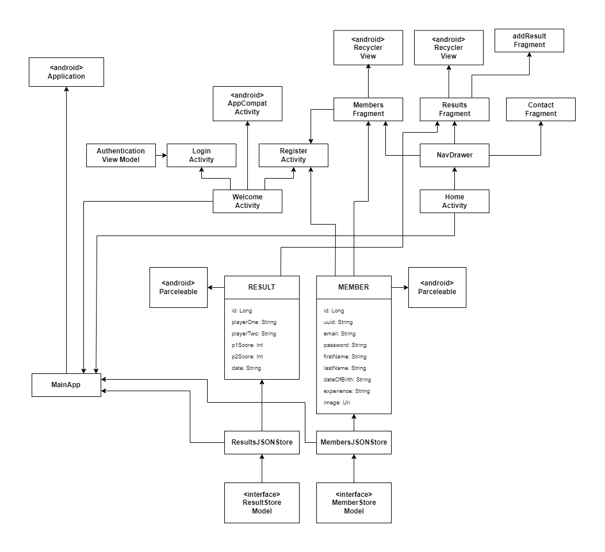

# Cork Tennis Club

An Android mobile app for recording data relating to a fictional tennis club.

## Functionality

Users of the app can perform the following functions:

- Log in or registration is required to gain access to the app. Firebase authentication is used to store user credentials. Users can also choose to login using a Google account.
- Results from tennis matches played between members at the club can be added. A result model has the following properties: date, players and score.
- Existing results can be edited or deleted.
- A list of members at the club can be viewed. A member model has the following properties: name, email, password, date of birth, experience level and profile picture.
- A member can update or delete their account - they do not have permission to make changes to other user accounts.
- A contact page displays all relevant contact information for the club. It displays the club location on an embedded map using the [Google Maps API](https://developers.google.com/maps).

## UML Diagram

## UX

A core aspect of the UX is the nav drawer menu. The nav drawer consists of three fragments (results, members, contact). The fourth option is  logout. Working with a nav drawer menu provides a much more intuitive experience for the user.
Swiping to edit and delete users/results has been introduced. If a user swipes to delete, a confirmation dialog is displayed to confirm the user's action.
A date picker has been introduced for inputting dates. The input of a date is required for the date of birth when registering a user, and for inputting the date of a match result. The date picker displays in calendar form when adding a result, and displays as a spinner when entering date of birth.

## DX

Aspects of the MVVM design pattern approach were implemented to keep a structured folder hierarchy.
Interfaces were used for the Result and Member stores to ensure type safety.
Data binding was used in the Result and Member adapters for a more seamless developer experience.

## Git Approach

The app had new features introduced over multiple tagged releases.

## Personal Statement

Developing this app was a challenge, but a rewarding one nonetheless. Prior to starting this module I had little knowledge on the world of mobile app development, so it was a great opportunity to gain experience with the fundementals of building a mobile app such as file hierarchies, layouts, UX/DX principles, emulators, adapters, navigation methods etc. It was my first exposure to Kotlin, so it was interesting to learn how it stacked up against Java and what the pros and cons of the language were. It was also good to gain experience with a new IDE in Android Studio.

## References

[Date picker implementation](https://www.tutorialkart.com/kotlin-android/android-datepicker-kotlin-example/)
[Date picker styling](https://stackoverflow.com/questions/44418149/cant-get-android-datepickerdialog-to-switch-to-spinner-mode)